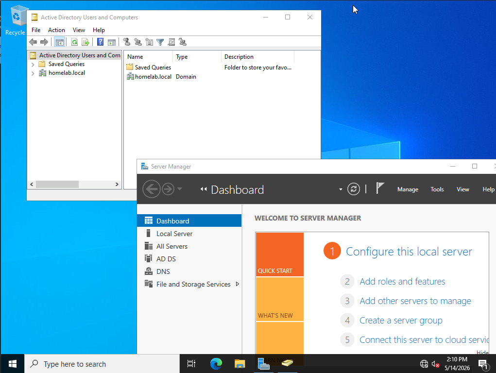
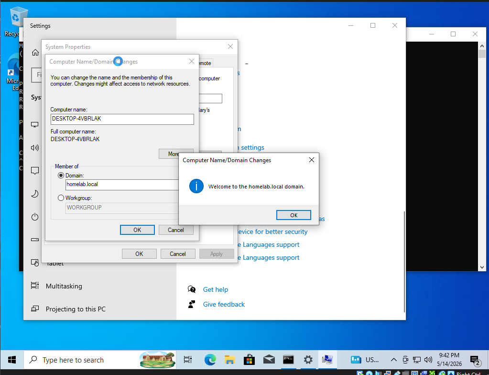
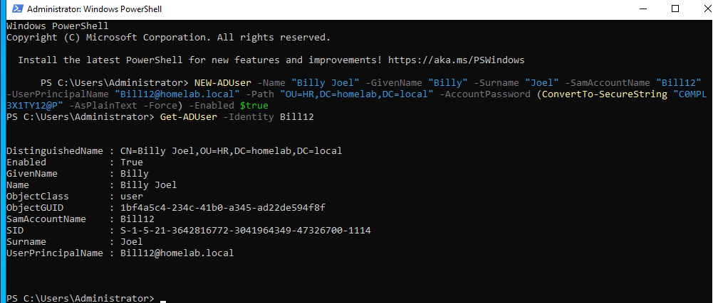
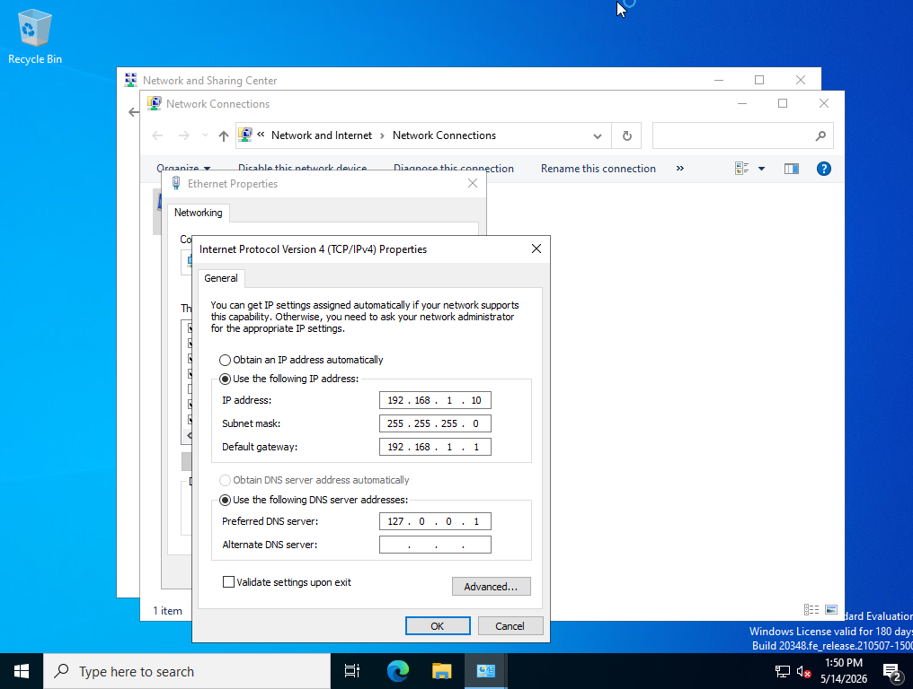
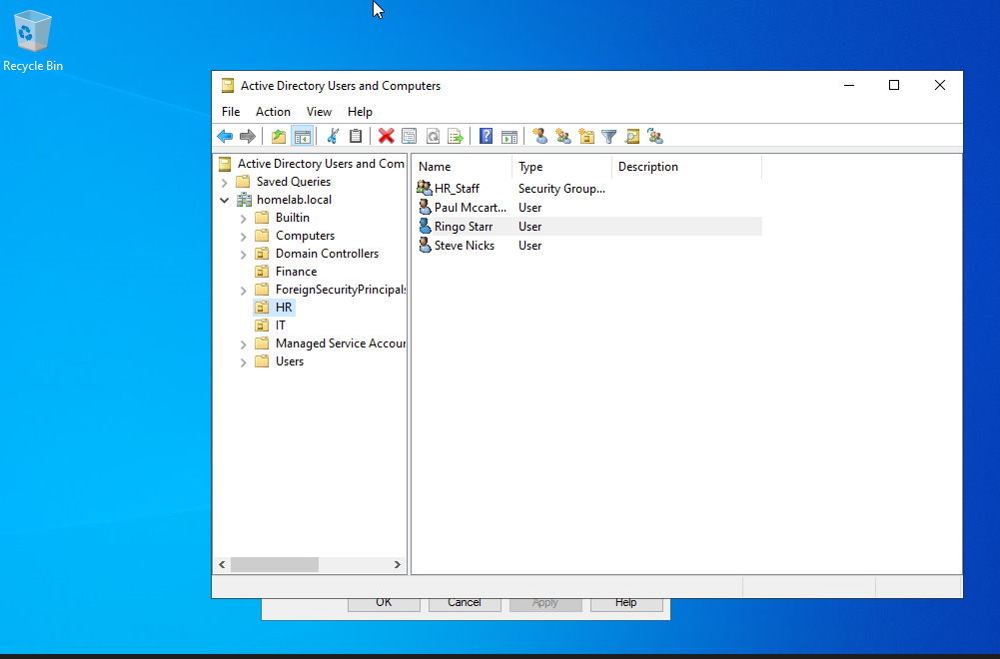
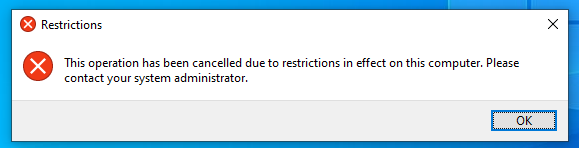
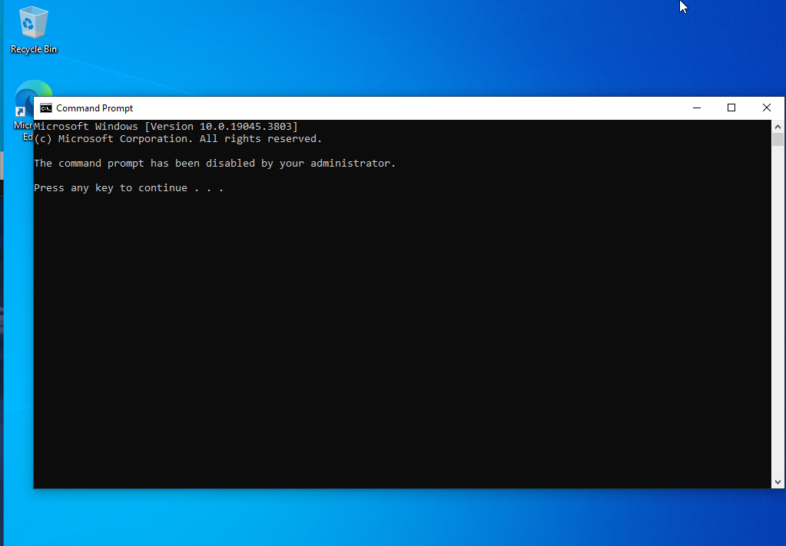
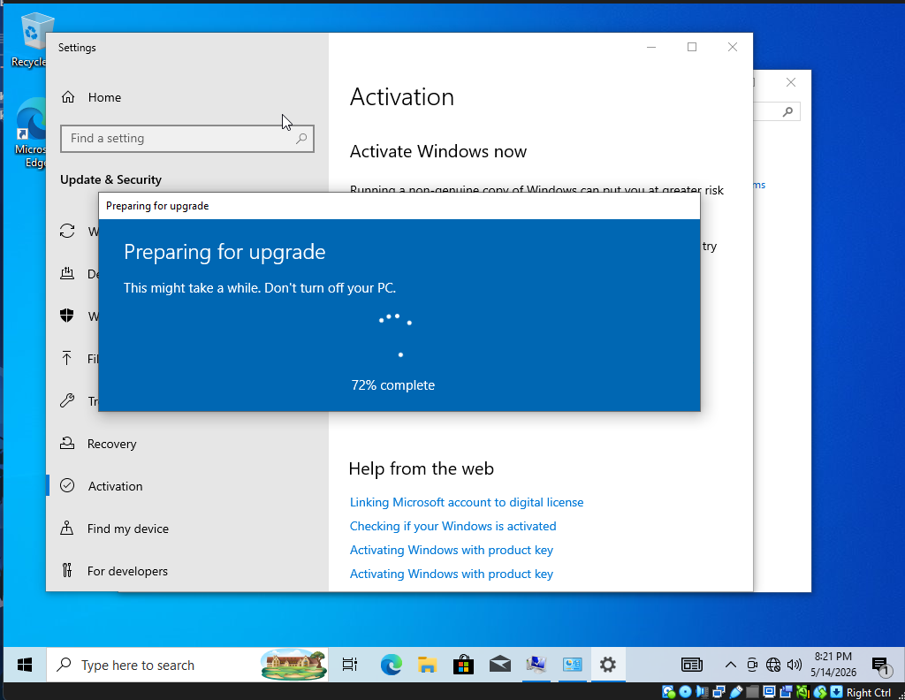
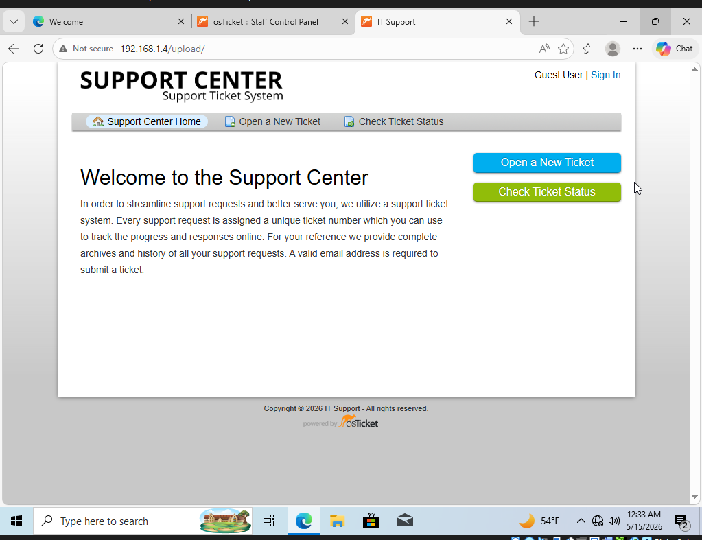

# Active Directory Home Lab

Created a home lab to simulate a real enterprise Windows 
network. This project demonstrates hands-on experience 
with Active Directory, Group Policy, and simulated enterprise ticketing systems.

## Environment

- Windows Server 2022 Domain Controller (DC01)
- Windows 10 Pro Client (joined to domain)
- Ubuntu Server 22.04 (osTicket)
- Hosted on VirtualBox

## Skills Demonstrated

- Promoted server to Domain Controller
- Designed OU structure for HR, IT, and Finance departments
- Created and managed user accounts via GUI and PowerShell
- Wrote and deployed Group Policy Objects (GPOs)
- Joined client machines to domain
- Simulated helpdesk tasks (password resets, account lockouts)
- Configured a MySQL database for IT ticketing software
- Set up an Apache web server on Ubuntu Server
- Configured osTicket to simulate enterprise IT support ticketing

## Network Configuration

- Domain: homelab.local
- Static IP assigned to DC
- DNS configured to point to Domain Controller

## Domain Configuration

- Created Organizational Units for HR, Finance, and IT departments
- Created and managed user accounts using Windows PowerShell
- Configured Group Policy Objects for each department
- Joined Windows 10 Pro client to domain

## Group Policy Objects

### HR Policy
- Enforced 15 minute screen lock timeout
- Disabled removable storage to protect sensitive employee data
- Restricted Control Panel access
- Disabled command prompt access

### Finance Policy
- Enforced 10 minute screen lock timeout
- Disabled removable storage
- Restricted Control Panel access
- Blocked command prompt access

### IT Policy
- Enabled remote desktop access
- Mapped shared network drives to IT_Share
- Granted access to administrative tools
- Enabled PowerShell script execution

## Challenges and Solutions

**Issue:** Windows 10 Home does not support domain joining
**Solution:** Used Microsoft's public upgrade key to upgrade 
to Windows 10 Pro in place via Settings → Update & Security 
→ Activation → Change product key. Only Pro, Education, and 
Enterprise editions support domain joining.

**Issue:** Windows 10 client could not reach Domain Controller
**Solution:** Discovered both VMs were on different subnets. 
Resolved by configuring both VMs to use the same NAT Network 
in VirtualBox ensuring they shared the same subnet.

**Issue:** Windows Server installed without GUI
**Solution:** Discovered the Desktop Experience option must 
be selected during installation. Reinstalled selecting 
Windows Server 2022 Standard Evaluation (Desktop Experience).

## osTicket: Enterpsie Ticketing Software

Deployed osTicket on an Ubuntu Server 22.04 VM to simulate 
an enterprise IT help desk environment. This allows for 
practicing real helpdesk workflows including ticket creation, 
assignment, and resolution.

### Environment
- Ubuntu Server 22.04
- Apache2 Web Server
- MySQL Database
- PHP

### Configuration
- Deployed LAMP stack (Linux, Apache, MySQL, PHP) on 
  Ubuntu Server 22.04
- Created a dedicated MySQL database and user for osTicket
- Configured Apache to serve the osTicket web application
- Set up admin and client portals for ticket management

