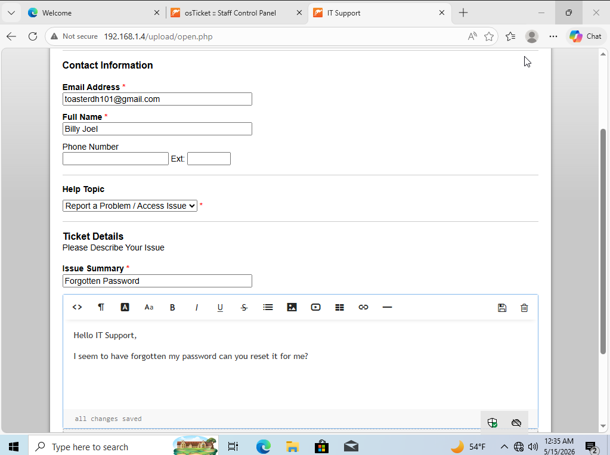
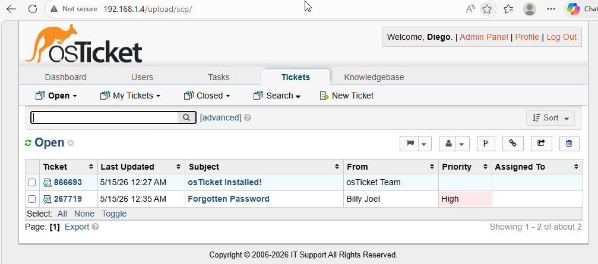
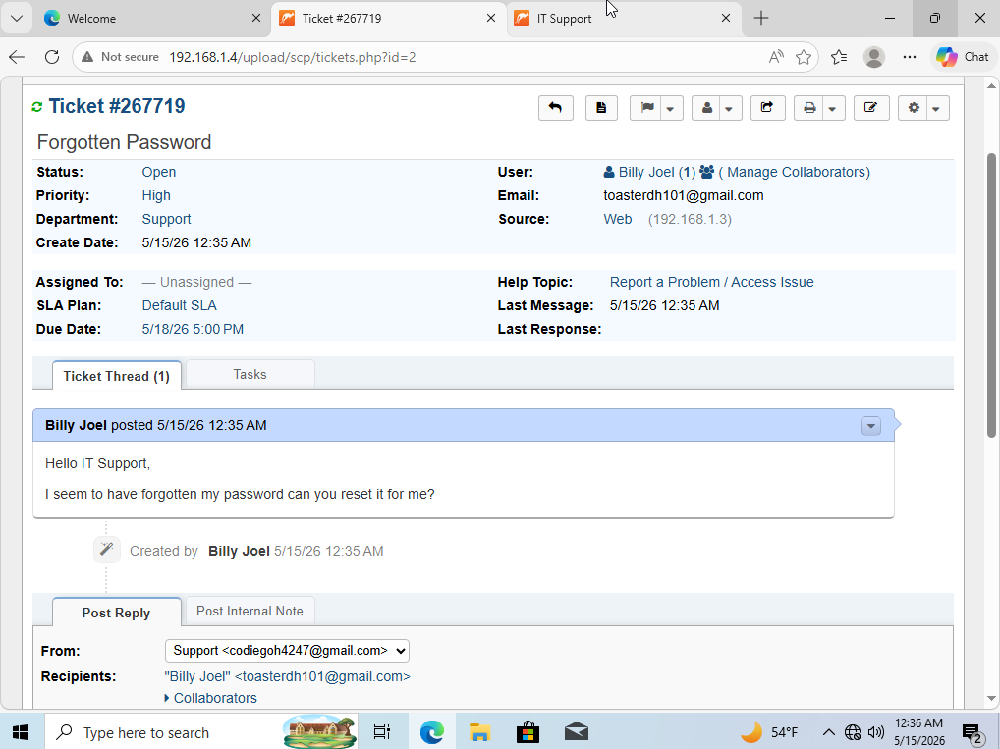
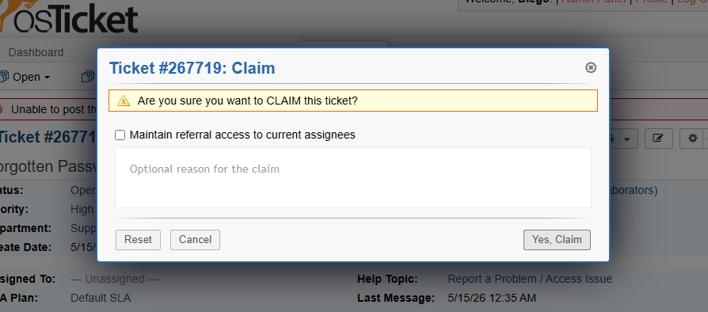
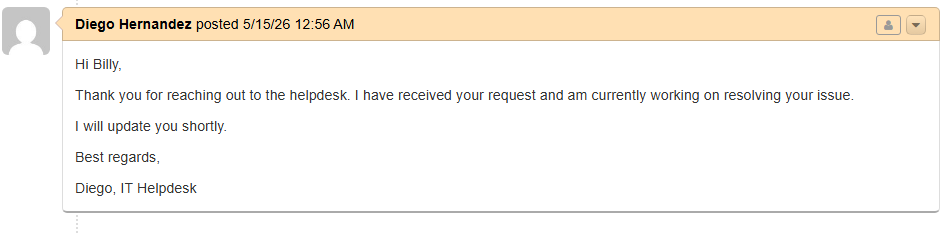
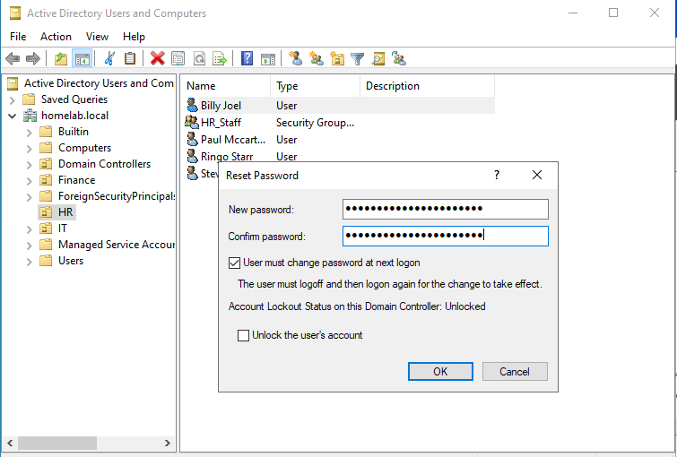
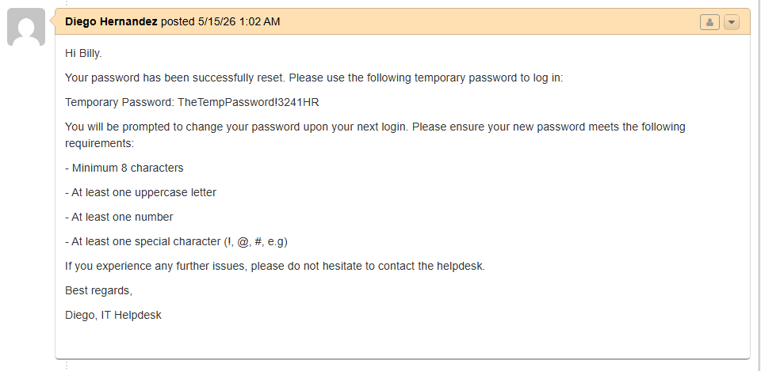
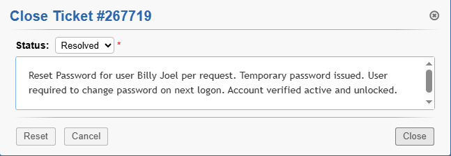
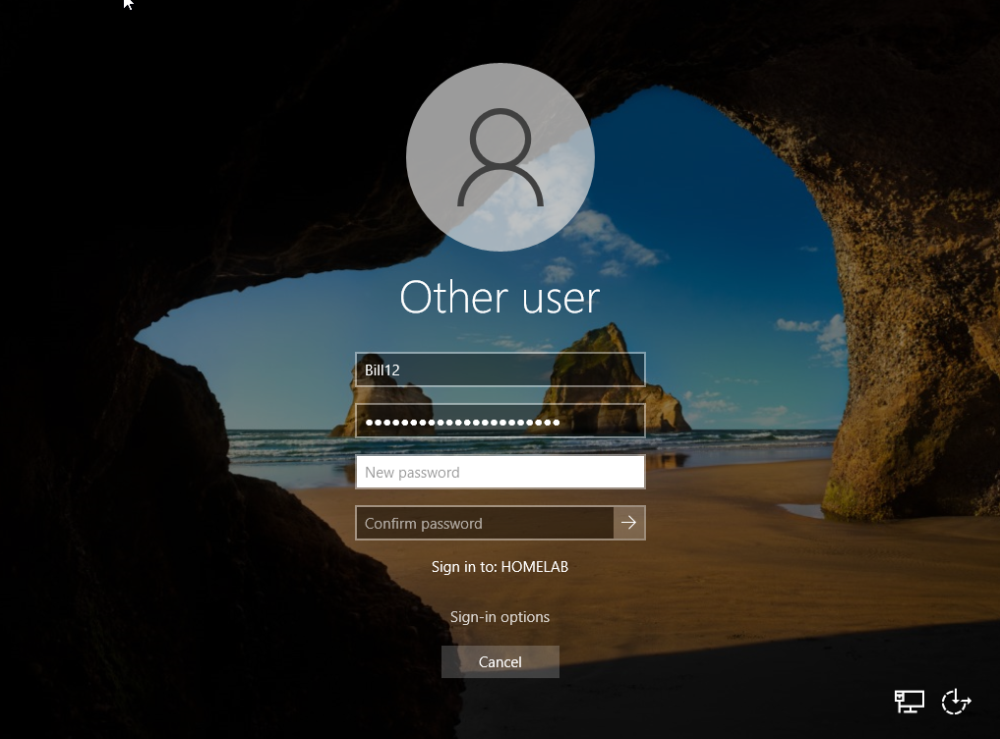

# Scenario: Password Reset

## Overview
Billy Joel, a user in the HR department, has forgotten his password 
and is unable to log into his account. To resolve this, Billy will 
submit a support ticket through the osTicket client portal. As the 
IT administrator, we will claim the ticket, reset his password in 
Active Directory, communicate the resolution, and verify the fix.

---

## Step 1 — User Submits a Ticket
Billy navigates to the osTicket client portal and submits a ticket 
describing his issue. He provides his name, email, and a brief 
description of the problem so the helpdesk can identify and 
resolve the issue quickly.

---

## Step 2 — IT Admin Claims the Ticket
Logging into the osTicket admin panel, we locate Billy's ticket on 
the dashboard. We assign the ticket to ourselves and send Billy an 
initial response letting him know we have received his request and 
are actively working on a resolution.

---

## Step 3 — Reset Password in Active Directory
To reset Billy's password we open **Active Directory Users and 
Computers** via the Tools dropdown in Server Manager. We locate 
Billy Joel's user account, right-click it, and select 
**Reset Password**. We set a secure temporary password and check 
**"User must change password at next logon"** to ensure Billy 
creates his own permanent password upon logging back in.

---

## Step 4 — Communicate Resolution and Close Ticket
With the password reset complete, we reply to Billy's ticket with 
his temporary password and a reminder of the company password 
policy. Once communicated, we close the ticket and leave a short 
internal note documenting what was done and how it was resolved.

---

## Step 5 — Verify the Fix
To confirm everything is working correctly, we log into the Windows 
10 client as Billy Joel using the temporary password. Billy is 
prompted to set a new permanent password on first login — 
confirming the ticket has been fully resolved.

---

## Summary
| Step | Action | Tool Used |
|---|---|---|
| 1 | User submits ticket | osTicket Client Portal |
| 2 | Admin claims ticket | osTicket Admin Panel |
| 3 | Password reset | Active Directory Users and Computers |
| 4 | Resolution communicated | osTicket Admin Panel |
| 5 | Fix verified | Windows 10 Client |
