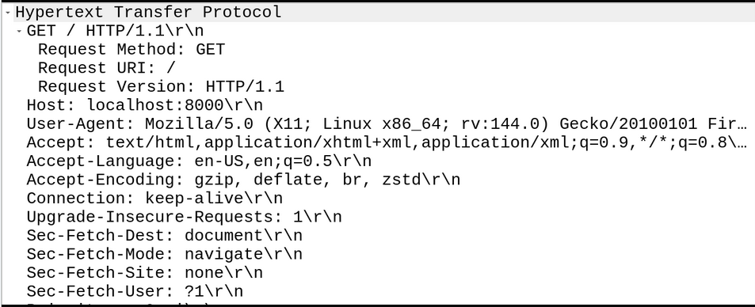
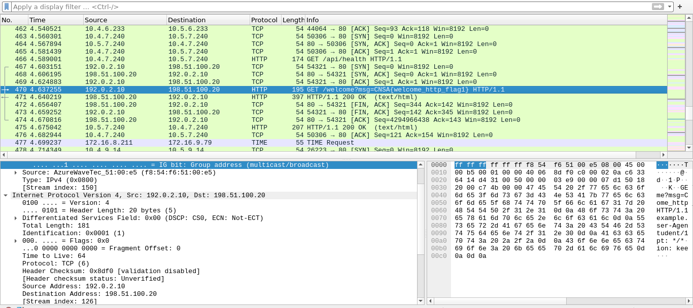

# HTTP Packet Analysis CTF with Wireshark

A technical workshop and challenge designed to teach HTTP protocol
analysis using Wireshark to the UCSC Computer Networking Student Association.

The session included a walkthrough of HTTP communication followed by
a packet analysis challenge where participants had to extract hidden
information from a network capture.

---

## Overview

This project was created for a Computer Networking club I run
to help students understand how HTTP traffic works at the packet level.

The workshop covered:

- TCP connection establishment
- HTTP request and response structure
- Inspecting HTTP headers in Wireshark
- Packet-level traffic analysis

Participants then solved a small CTF challenge by analyzing a
packet capture file.

---

## Technologies Used

- Wireshark
- Python
- Scapy
- HTTP
- TCP/IP networking

---

## HTTP Request Analysis

This packet capture shows a standard HTTP GET request sent
from a client to a web server.

Key headers analyzed:

- Host
- User-Agent
- Accept
- Cookie

---

## CTF Challenge

A custom packet capture was generated using Scapy containing
hidden information within HTTP traffic.

Participants had to:

1. Open the PCAP in Wireshark
2. Filter HTTP packets
3. Inspect headers and payload data
4. Identify the hidden flag

---

## Example Packet

The flag was embedded inside a custom HTTP header.

---

## Challenge Files

The challenge PCAP and generation script are included in the CTF-Challenge directory
