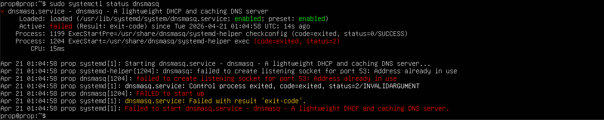
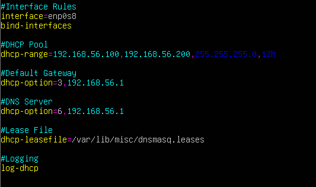
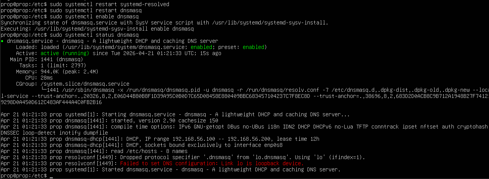
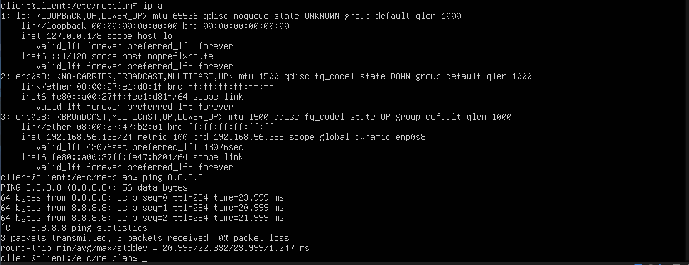

# Configuring a DHCP Server with dnsmasq

In this project I configured my Linux Server VM as a DHCP server using **dnsmasq**, a lightweight server application designed for small networks. With DHCP in place, devices on the internal network no longer need manually assigned IP addresses; the server handles that automatically.

---

## Step 1 — Install dnsmasq

```bash
sudo apt update
sudo apt install dnsmasq
```

After installing, check the service status:

```bash
sudo systemctl status dnsmasq
```

You'll likely see it in a **failed** state at this point, that's expected. dnsmasq doesn't know which interfaces to bind to yet, so it stumbles on startup. We'll fix that in the configuration.


---

## Step 2 — Configure dnsmasq

> **Important:** Make sure you configure DHCP on your **internal network interface only**. Running a DHCP server on your WAN interface would mean handing out IPs to devices outside your network, definitely not what we want. In my case the internal interface is `enp0s8`.

Open the dnsmasq configuration file:

```bash
sudo nano /etc/dnsmasq.conf
```

Add the following configuration:



### Configuration Breakdown

**`interface=enp0s8`**
Tells dnsmasq to only listen for DHCP requests on the LAN interface. Without this, dnsmasq listens on all interfaces, including the WAN.

**`bind-interfaces`**
Forces dnsmasq to strictly bind only to the specified interface. Without this, dnsmasq uses a wildcard socket and merely filters traffic, which can cause port conflicts with other services like `systemd-resolved`.

**`dhcp-range=192.168.1.100,192.168.1.200,255.255.255.0,12h`**
The heart of the DHCP config. Breaking it down:

| Value | Description |
|-------|-------------|
| `192.168.1.100` | Start of the IP pool |
| `192.168.1.200` | End of the IP pool (101 usable addresses) |
| `255.255.255.0` | Subnet mask handed to clients (`/24` network) |
| `12h` | Lease time — clients must renew after 12 hours |

The router's own IP (`192.168.1.1`) sits outside this range intentionally — the DHCP server should never hand out its own IP.

**`dhcp-option=3,192.168.1.1`**
DHCP Option 3 sets the **default gateway**. This tells clients to route all non-LAN traffic through `192.168.1.1`, meaning client VMs no longer need a manually configured gateway.

**`dhcp-option=6,192.168.1.1`**
DHCP Option 6 sets the **DNS server**. This points clients to the router for DNS resolution. dnsmasq will forward queries upstream for now, a foundation we'll build on in the DNS project.

**`dhcp-leasefile=/var/lib/misc/dnsmasq.leases`**
Defines where dnsmasq stores its lease database, tracking which IP was handed to which MAC address. On restart, dnsmasq reads this file to avoid handing out IPs that are already in use.

**`log-dhcp`**
Enables detailed DHCP logging so you can watch the full DORA process (DISCOVER, OFFER, REQUEST, ACK) in real time, invaluable for troubleshooting.

---

## Step 3 — Resolve the Port 53 Conflict

On Ubuntu, there's a common conflict between `dnsmasq` and `systemd-resolved` over **port 53**. First check if `systemd-resolved` is running:

```bash
sudo systemctl status systemd-resolved
```

If it is, fix the conflict by editing its configuration file:

```bash
sudo nano /etc/systemd/resolved.conf
```

Uncomment and set the following:

```conf
[Resolve]
DNSStubListener=no
```

This tells `systemd-resolved` to stop binding to port 53, freeing it up for dnsmasq. Then restart the service:

```bash
sudo systemctl restart systemd-resolved
```

---

## Step 4 — Start and Enable dnsmasq

```bash
sudo systemctl restart dnsmasq
sudo systemctl enable dnsmasq
sudo systemctl status dnsmasq
```

This time the status should show **active (running)**.


---

## Step 5 — Update the Client VM

On the client VM, open its Netplan configuration and replace the static IP setup with a single DHCP line:

```yaml
network:
  version: 2
  ethernets:
    enp0s8:
      dhcp4: true
```

Apply the configuration:

```bash
sudo netplan apply
```

---

## Step 6 — Verify Connectivity

Check that the client received an IP from the DHCP pool (`192.168.1.100–200`):

```bash
ip a
```


Then confirm internet connectivity:

```bash
ping 8.8.8.8
```

A successful ping means the DHCP server is fully operational. You can also inspect the lease file on the router to see the active assignment:

```bash
cat /var/lib/misc/dnsmasq.leases
```

Each line shows the lease expiry time, the client's MAC address, its assigned IP, and its hostname.

---

## What I Learned

This project was my first time working with a tool like dnsmasq, and I'm starting to notice a pattern in Linux, configuring services really does come down to editing a config file in the CLI. As someone who grew up relying on GUIs for everything, hands-on experience like this is genuinely shifting how I understand the way applications work under the hood. Seeing something like `dhcp4: true` replace an entire block of manual network configuration really drives home how much these protocols are doing behind the scenes.
