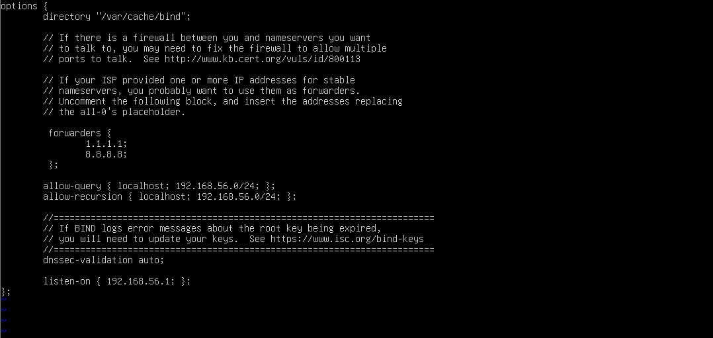
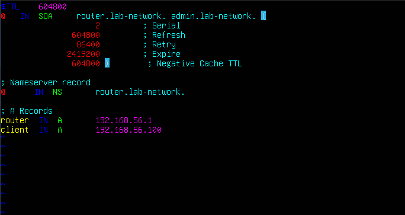
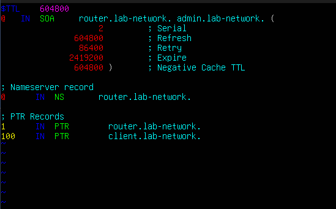
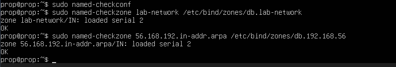
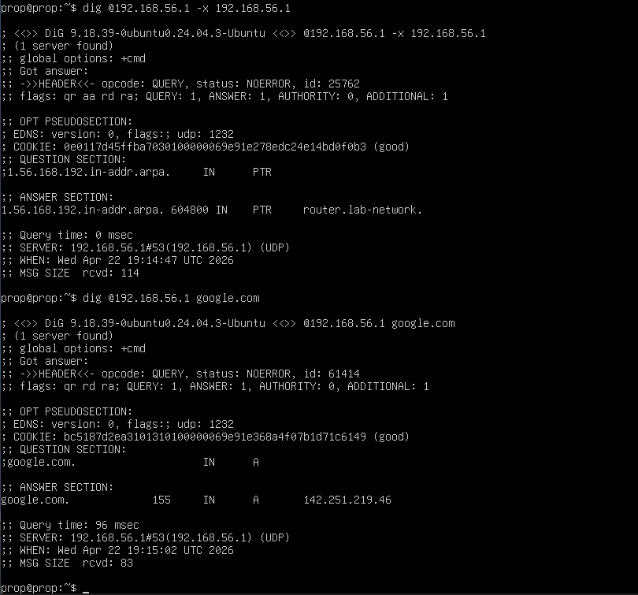

# Configuring a Local DNS Server with bind9

In this project I turned my Linux Server VM into a fully functional DNS server using **bind9**, an open source DNS server that's widely used in real-world production environments. The goal was to give my home lab its own DNS infrastructure so devices can resolve local hostnames like `router.lab-network` instead of relying entirely on external DNS servers.

---

## Step 1 — Install bind9

```bash
sudo apt update
sudo apt install bind9 bind9utils bind9-doc
```

- `bind9` — the DNS server itself
- `bind9utils` — includes tools like `named-checkconf` and `named-checkzone` for validating configs before applying them
- `bind9-doc` — documentation

---

## Step 2 — Configure Global Options

The global settings for bind9 live in `/etc/bind/named.conf.options`. Open it and update the configuration:

```bash
sudo nano /etc/bind/named.conf.options
```



### Breaking It Down

**`forwarders`** — When bind9 receives a query it can't answer locally (like `google.com`), it forwards the request to these upstream DNS servers as a fallback. `1.1.1.1` is Cloudflare's public DNS and `8.8.8.8` is Google's.

**`allow-query`** — Specifies which machines are allowed to send DNS queries to our server. Setting this to `192.168.56.0/24` means any device on the LAN can query it, this is an important security setting since we don't want to run an open DNS server on the internet.

**`allow-recursion`** — Similar to `allow-query`, this restricts which machines can use our server as a recursive resolver. Open recursion is a well-known DNS attack vector so keeping this LAN-only is important.

**`listen-on`** — Tells bind9 to only listen for queries on our LAN interface IP (`192.168.56.1`). Without this it would listen on all interfaces including the WAN.

---

## Step 3 — Declare the Zone Files

Before creating the actual zone files we need to declare them in `/etc/bind/named.conf.local`. But first, what exactly is a zone?

> A **zone** is a chunk of the DNS namespace that your server is authoritative for. Think of it as a database your server owns and is responsible for answering questions about.

We'll be creating two zones:
- A **forward zone** — translates hostnames → IP addresses
- A **reverse zone** — translates IP addresses → hostnames

```bash
sudo nano /etc/bind/named.conf.local
```

![declare](./Pictures/Declare-Zones.png

### Breaking It Down

**`zone "lab-network"`** — Declares our forward zone. Any query for a hostname ending in `lab-network` will be answered by our server using the records in the zone file we specify.

**`type master`** — Tells bind9 that this machine is the authoritative source for this zone. In a real network you could configure `type slave` servers that sync from the master, giving you redundancy in case the master goes down, something I'd like to explore in a future project.

**`zone "56.168.192.in-addr.arpa"`** — Declares our reverse zone. Notice the IP `192.168.56` is written **backwards**, this is a requirement for reverse DNS zones. The `.in-addr.arpa` suffix is a special domain reserved specifically for reverse lookups.

---

## Step 4 — Create the Zone Files

First, create the directory that will hold our zone files:

```bash
sudo mkdir /etc/bind/zones
```

### Forward Zone File

```bash
sudo nano /etc/bind/zones/db.lab-network
```



### Breaking It Down

**`$TTL 604800`** — Sets the default TTL (Time to Live) for all records in this zone. 604800 seconds equals one week, meaning other DNS servers will cache these records for that long before requesting fresh ones.

**`SOA` (Start of Authority)** — Every zone file requires exactly one SOA record. It declares the zone's master nameserver and several important timer values:

| Field | Description |
|-------|-------------|
| `router.lab-network.` | The primary nameserver for this zone. The trailing dot is required, it means "fully qualified domain name" |
| `admin.lab-network.` | The admin contact email with `@` replaced by `.` (represents `admin@lab-network`) |
| `Serial` | A version number, **must be incremented every time the file is edited** so secondary nameservers know the zone has changed |
| `Refresh` | How often secondary servers check for updates |
| `Retry` | How long a secondary waits before retrying a failed refresh |
| `Expire` | How long a secondary keeps serving the zone if it can't reach the master |
| `Negative Cache TTL` | How long to cache a "this record doesn't exist" response |

**`NS` record** — Declares `router.lab-network.` as the nameserver for this zone. The `@` symbol is shorthand for the zone itself (`lab-network`).

**`A` records** — The actual hostname → IP mappings that clients query most often.

---

### Reverse Zone File

```bash
sudo nano /etc/bind/zones/db.192.168.56
```



This file is nearly identical to the forward zone file with one key difference, instead of `A` records we're using **`PTR` records**. PTR records are essentially the reverse of A records, mapping an IP address back to a hostname.

Notice that only the **last octet** of each IP is used (`1` for `192.168.56.1`, `100` for `192.168.56.100`). The rest of the address is already defined by the zone name `56.168.192.in-addr.arpa`, so bind9 assembles the full address automatically.

---

## Step 5 — Validate the Configuration

This is where `bind9utils` earns its place. Always validate your config files before restarting, a single syntax error will prevent bind9 from starting entirely.

Check the main configuration:

```bash
sudo named-checkconf
```

No output means no errors. Then validate each zone file:

```bash
sudo named-checkzone lab-network /etc/bind/zones/db.lab-network
sudo named-checkzone 56.168.192.in-addr.arpa /etc/bind/zones/db.192.168.56
```

Both should return `OK`.



---

## Step 6 — Disable dnsmasq DNS

Now that bind9 is handling DNS we need to tell dnsmasq to step aside and stop acting as a DNS forwarder. Open the dnsmasq config:

```bash
sudo nano /etc/dnsmasq.conf
```

Add the following line:

```conf
port=0
```

Setting `port=0` completely disables dnsmasq's DNS functionality while leaving DHCP fully intact. bind9 now owns all DNS duties.

---

## Step 7 — Restart Services and Test

Restart both services to apply all changes:

```bash
sudo systemctl restart bind9
sudo systemctl restart dnsmasq
```

Then test DNS resolution using `dig`:

```bash
# Forward lookup — hostname to IP
dig @192.168.56.1 router.lab-network

# Reverse lookup — IP to hostname
dig @192.168.56.1 -x 192.168.56.1

# External query — tests upstream forwarding
dig @192.168.56.1 google.com
```

In the output look for `status: NOERROR` in the header and an `ANSWER SECTION` containing the correct record. All three queries resolving successfully means the DNS server is fully operational.



---

## What I Learned

This project taught me what a DNS zone actually is and how to build one from scratch using zone files. I also learned why reverse zones matter and how PTR records work, they're a detail that's easy to overlook but are used by tools like `ping`, `traceroute`, and security systems to verify identity.

Something that genuinely surprised me was realizing that a DNS server doesn't require any special hardware, it's just software running on a Linux VM. I always assumed DNS was handled by dedicated physical appliances similar to routers or switches, so building one out of a plain VM was a bit of an eye-opener.

Going forward I'd love to set up a slave DNS server to add some redundancy to the network, so if the master ever goes down there's a backup ready to take over.
