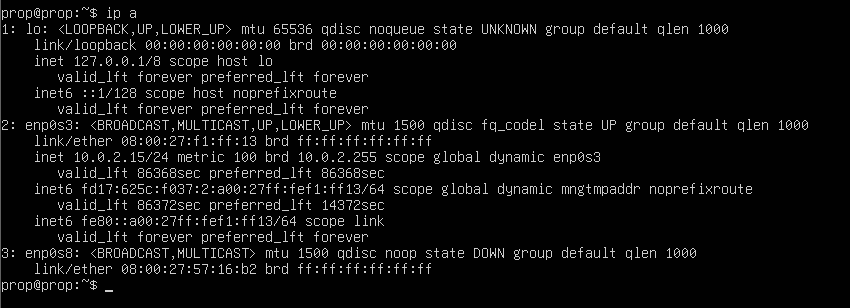
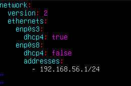
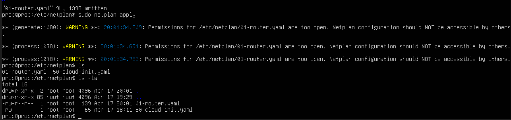
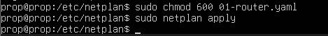
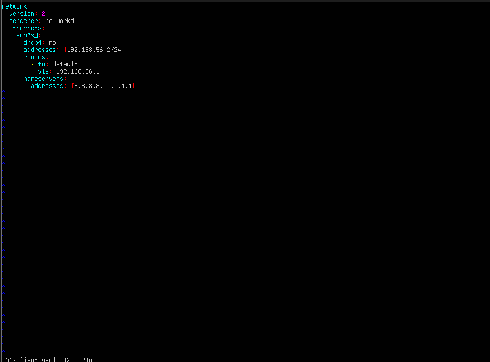
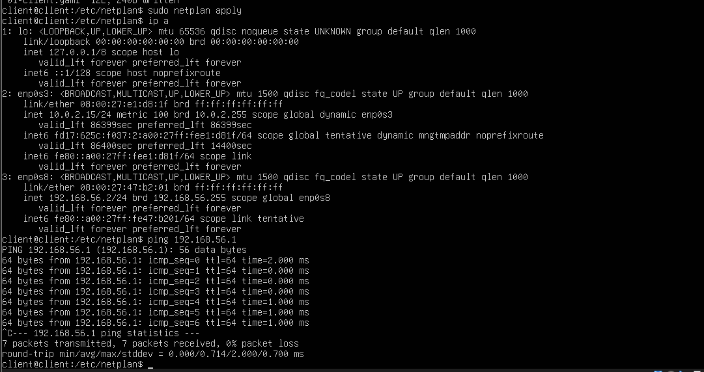

# Linux Server as a Router with NAT

A walkthrough of how I configured an Ubuntu Server VM to function as a router with Network Address Translation (NAT) using IPtables.

---

## Overview

This project covers the full process of turning a Linux server into a functional router — configuring a second network interface, enabling IP forwarding, setting up NAT, and validating connectivity through a client VM.

> **Note:** Some steps in this guide are specific to a virtual environment (VirtualBox). If you're working on physical hardware, skip the VM-specific configuration sections.

---

## Prerequisites

- Ubuntu Server installed on a VM (or physical machine)
- A hypervisor such as VirtualBox (for the VM setup steps)
- A second network interface (physical or virtual)
- Basic familiarity with the Linux CLI

---

## Step 1 — Configure the Second Network Interface (VM Only)

A router needs at least two network interfaces: one facing the WAN (internet) and one facing the LAN (your internal network).

1. **Power off** your VM.
2. Open your hypervisor's **Network Settings**.
3. You'll see **Adapter 1** already configured for internet access — leave it as-is.
4. Navigate to **Adapter 2**, check **Enable Network Adapter**, and set *Attached to* → **Internal Network**.
5. Give the internal network a name (e.g., `lab-network`).
6. Click **OK** and restart the VM.

Once booted, verify the second interface is recognized:

```bash
ip a
```


You'll notice the second interface has no IP address assigned yet — that's expected. We'll handle that in the next step.

---

## Step 2 — Assign a Static IP to the LAN Interface

To give the LAN interface a static IP, navigate to the Netplan configuration directory:

```bash
cd /etc/netplan/
```

Open your config file (e.g., `01-router.yaml`) — create it if it doesn't exist — and add your static IP configuration for the LAN interface.



Apply the configuration:

```bash
sudo netplan apply
```

**Heads up:** You may see warnings about the config file having overly permissive file permissions. Tighten them up by restricting access to the root user only:

```bash
sudo chmod 600 /etc/netplan/01-router.yaml
```

---

## Step 3 — Enable IP Forwarding

IP forwarding is what truly turns a Linux machine into a router. Without it, the kernel drops packets that aren't destined for the local machine instead of forwarding them between interfaces.

Open `/etc/sysctl.conf` in a text editor and uncomment the following line:

```
net.ipv4.ip_forward=1
```

This tells the kernel to forward packets between network interfaces rather than discard them.

---

## Step 4 — Configure IPtables

IPtables is the Linux kernel's built-in packet filtering and NAT engine. We'll use it to set up NAT and control traffic flow between the LAN and WAN.

### 4a — Set Up NAT (Masquerading)

```bash
sudo iptables -t nat -A POSTROUTING -o enp0s3 -j MASQUERADE
```

| Flag | Description |
|------|-------------|
| `-t nat` | Targets the NAT table for modifying IP addresses |
| `-A POSTROUTING` | Applies the rule after routing decisions are made |
| `-o enp0s3` | Specifies the outbound (WAN) interface |
| `-j MASQUERADE` | Replaces the packet's source IP with the router's WAN IP |

### 4b — Allow LAN → WAN Traffic

```bash
sudo iptables -A FORWARD -i enp0s8 -o enp0s3 -j ACCEPT
```

| Flag | Description |
|------|-------------|
| `-i enp0s8` | Incoming interface (LAN) |
| `-o enp0s3` | Outgoing interface (WAN) |
| `-j ACCEPT` | Permits the traffic through |

### 4c — Allow Return Traffic (Established Connections)

```bash
sudo iptables -A FORWARD -i enp0s3 -o enp0s8 -m state --state RELATED,ESTABLISHED -j ACCEPT
```

| Flag | Description |
|------|-------------|
| `-m state` | Loads the connection tracking match module |
| `--state RELATED,ESTABLISHED` | Matches packets belonging to existing or related connections |
| `-j ACCEPT` | Permits the return traffic back into the LAN |

### 4d — Persist the Rules Across Reboots

Install the persistence package and save the current ruleset:

```bash
sudo apt install iptables-persistent
sudo netfilter-persistent save
```

---

## Step 5 — Configure the Client VM

On your client VM, open its Netplan config and add the appropriate network settings pointing to your router as the gateway.



Apply the configuration:

```bash
sudo netplan apply
```

---

## Step 6 — Test Connectivity

Check that the interface is up:

```bash
ip a
```

Then test internet connectivity with a ping:

```bash
ping 8.8.8.8
```

A successful ping means your Linux router is up and running. 

---

## What I Learned

This project pushed me to get comfortable making network configuration changes purely through the CLI — something I used to avoid by relying on a GUI. Digging into Netplan, IP forwarding, and IPtables gave me a much better understanding of how routing and NAT actually work under the hood rather than just abstracting it away through a graphical interface.
