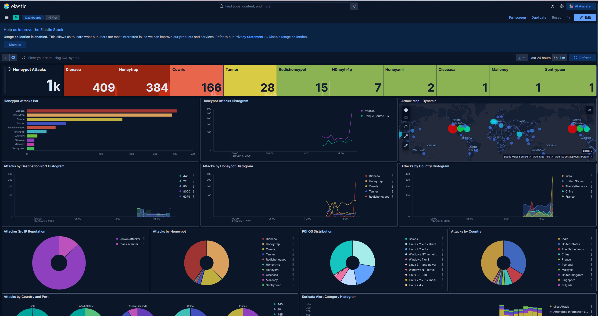

# SSH Honeypot Attack Analysis

A honeypot deployed on a public cloud server to monitor real-world
SSH brute-force attacks. Logs were collected and analyzed using the
ELK stack (Elasticsearch, Logstash, Kibana).

---

## Overview

This project involved deploying an SSH honeypot exposed to the internet
to capture and analyze malicious login attempts. The goal was to
observe attacker behavior and visualize attack patterns using Kibana.

---

## Technologies Used

- Linux
- Cowrie SSH Honeypot
- ELK Stack (Elasticsearch, Logstash, Kibana)
- Cloud VPS
- Python (log processing)

---

## System Architecture

Traffic from the internet was directed to the honeypot where login
attempts were logged and forwarded to Elasticsearch for indexing.
Kibana was used to create dashboards and visualizations.

---

## Data Collected

The honeypot captured:

- SSH login attempts
- Usernames and passwords used by attackers
- Source IP addresses
- Timestamps
- Command activity after login
- CVE Attempts
- GeoIP location of IP addresses

---

## Kibana Dashboard

The dashboard visualizes attack activity including:

- Total login attempts
- Top attacking IP addresses
- Username frequency
- Attack activity over time
- Password Attempts
- CVEs

---

## Observations

Some interesting patterns observed:

- Most common username attempts were:
  - root
  - anonymous
  - (blank)

- Attack traffic was heavily concentrated from a few geographic regions such as the U.S, China, India, and Australia

CVE-2024-6387 CVE-2024:
This CVE was used to exploit openSSH by utilizing a race condition which can lead sshd to handle signals incorrectly leading to a RCE vulnerability. Common ways to patch this vulnerability is to modify the sshd configuration file as a root user in order to change the Login Grace Time parameter to 0. This disables the SSHD server's ability to drop connections due to an authentication timeout. It is recommended to utilize other utilities such as fail2ban in order to further manage ssh connections. 

CVE-2002-0013:
CVE-2002-0013 is a vulnerability in SNMPv1 request handling that can allow attackers to implement a DDOS attack or gain [privileges via GetRequest, GetNextRequest, and SetRequest messages. It is strongly recommended to upgrade the protocol to a newer version that patches this known vulnerability in order to mitigate a new attack vector.
---

## Security Insights

This project demonstrates how frequently exposed services are
targeted by automated attacks and highlights the importance of:

- disabling password authentication
- using SSH keys
- limiting exposed services
- handling bruteforce attacks
